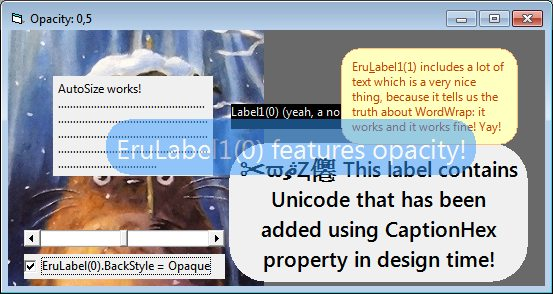

## EruLabel

### Description

This is a Label replacement control that gives you some limited CSS features (BorderRadius, Border, Margin, Padding, Opacity) and Unicode support. Rounded corners are limited because they are implemented using Windows API RoundRect which doesn't give the nicest results in every case.  For a more complete description visit VBForums thread: http://www.vbforums.com/showthread.php?t=626737
 
### More Info
 

             |
---                |---
**Submitted On**   |2010-09-04 12:00:02
**By**             |[Vesa Piittinen](https://github.com/Planet-Source-Code/PSCIndex/blob/master/ByAuthor/vesa-piittinen.md)
**Level**          |Advanced
**User Rating**    |5.0 (20 globes from 4 users)
**Compatibility**  |VB 6\.0
**Category**       |[Custom Controls/ Forms/  Menus](https://github.com/Planet-Source-Code/PSCIndex/blob/master/ByCategory/custom-controls-forms-menus__1-4.md)
**World**          |[Visual Basic](https://github.com/Planet-Source-Code/PSCIndex/blob/master/ByWorld/visual-basic.md)
**Archive File**   |[EruLabel218750942010\.zip](https://github.com/Planet-Source-Code/vesa-piittinen-erulabel__1-73411/archive/master.zip)

